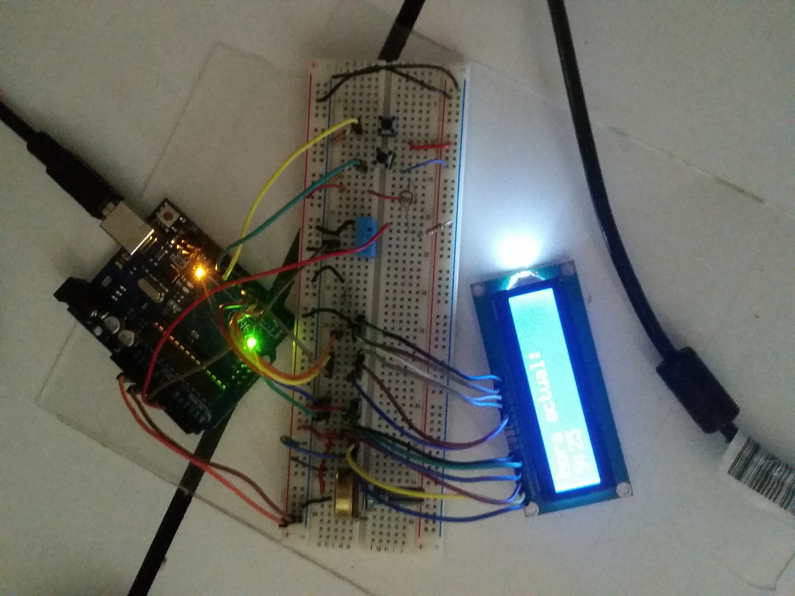
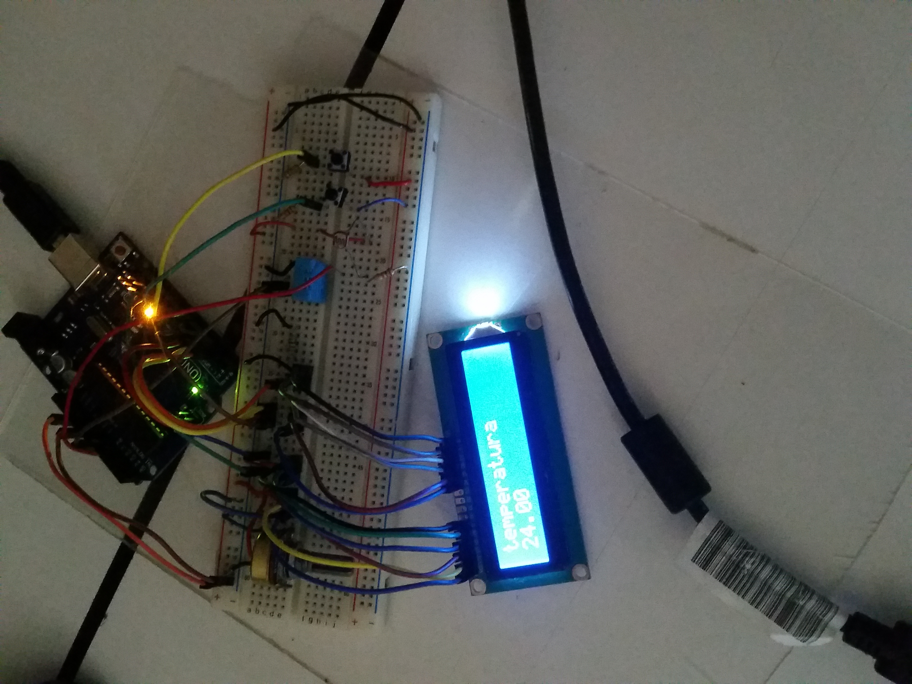
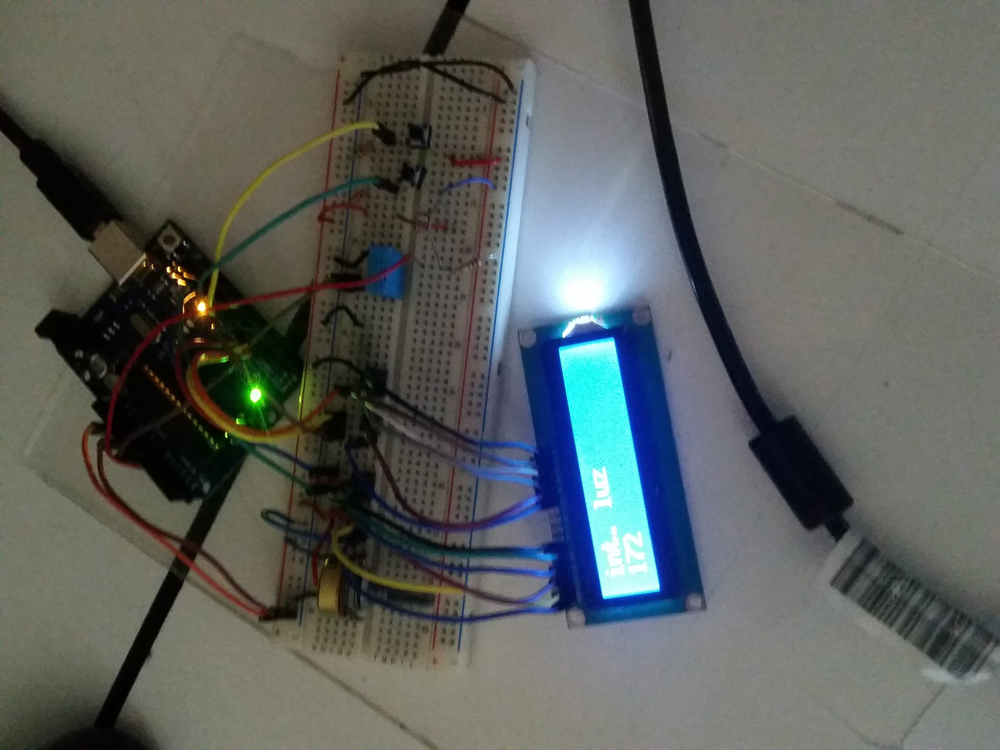
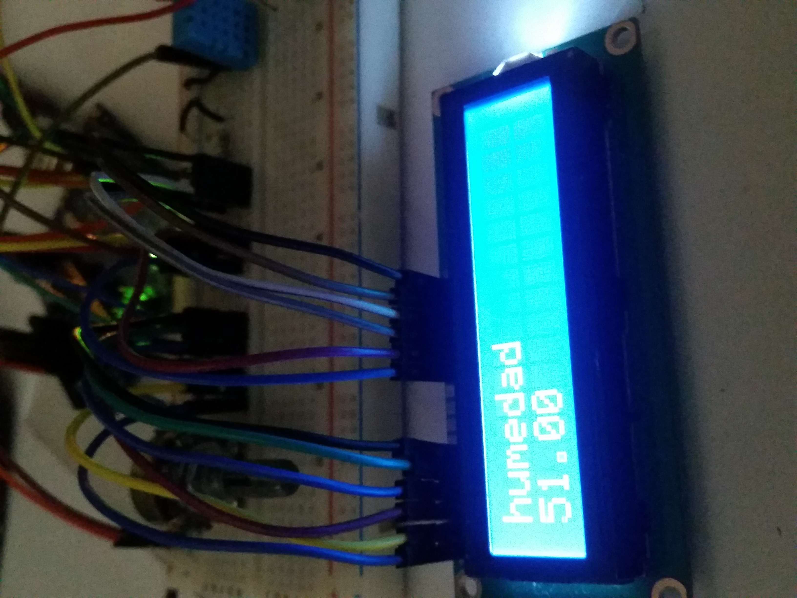
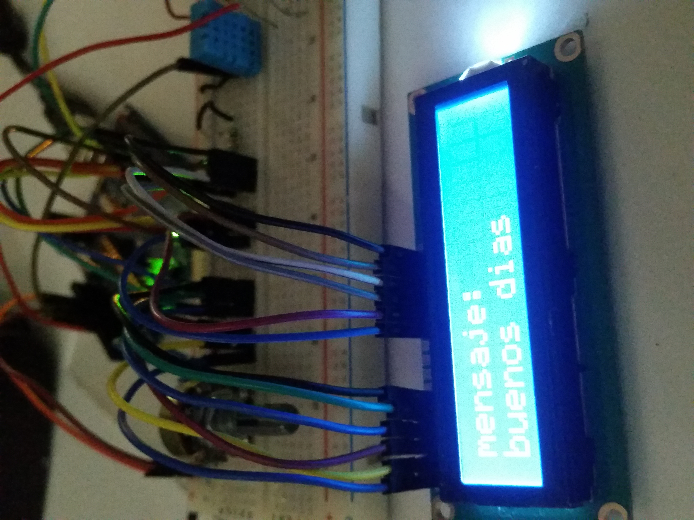

# Display

***
## indice 
+ [descripcion del programa](#descripcion)
+ [circuito en digital](#circuito)    
+ [codigo en arduino](#codigo)
+ [Evidencia (fotos)](#evidencia)
+ [Contacto](#contacto)
***
## Descripcion   
Realice un sistema de despliegue de mensajes en una pantalla LCD, 
el objetivo es que al llegar el individuo puedas ver un pequeño tablero electronico con una serie de mensajes o notas almacenados.

	Cada mensaje tiene las siguientes caracterisiticas 
		* Tienes que mostrar el mensaje que se entienda, con solo 140 caracteres de espacio.
		*Debe de mostrar fecha y hora en la que fue emitido el mensaje.
		*Además debe de mostrar un mensaje del estdo del tiempo (temperatura, luminocidad, humedad). 
    
    
El sistema debe de contener; 
		*Una interfaz de Hardware para navegar entre los mensajes. 
		*Una interfaz de software para enviar los mensajes desde la computadora via serial.
		*La interfaz de software debe permitir agregar mensajes y/ó borrarlos.
		
**Proposito.**

	El proposito educativo a denotar en esta practica es el uso de la comunicacion serial entre arduino y un lenguaje de programacion,
	en este caso se utilizo java con ayuda de Netbeans.

Material utilizado:

• 1 Placa arduino

•	4 resistencias de 10 k

•	2 push button

•	1 Display LCD

•	1 potenciometro 10 k

•	1 sensor de humedad y temperatura

•	1 protoboard

• 1 fotoresistor

• 30 cables para puntear aprox

***
## circuito 

***
## codigo en arduino
~~~
//Incluir la librería LiquidCrystal para poder hacer uso del Display en arduino
#include <LiquidCrystal.h>
//Incluimos las librerías DHT para poder hacer uso del sensor de temperatura y humedad
#include <Adafruit_Sensor.h>
#include <DHT.h>
#include <DHT_U.h>

//Definimos el tipo de sensor de temperatura y humedad
#define DHTTYPE DHT11  

//A continuación de declaran las variables de los pines de la pantalla LCD que se conectarán al arduino
const int rs = 12, en = 11, d4 = 5, d5 = 4, d6 = 3, d7 = 2;
//Pasamos las variables como parámetros para el metodo que llamara la pantalla lcd
LiquidCrystal lcd(rs, en, d4, d5, d6, d7);
//Pasamos las variables como parámetros para el metodo que llamara al sensor
DHT dht(temp, DHTTYPE);
//se indica que pin usara el boton de arriba del protoboard
int btnarriba=9;
//se indica que pin usara el boton de abajo del protoboard
int btnabajo=8;
//se indica que pin usara el fotoresistor
int pinLuz=1;
//se inicializa la variable que contendra la intensidad de la luz
int valorLuz=0;
//inicializa el contador que permitira saber que opcion del menu  se usará 
int cont=1;
//declara la variable que tendrá la entrada analogica para el sensor de temperatura
int temp=A0;
//inicializa la varible que se encargará de los calculos de la temperatura
float c=0;
//fin de la declaración de variables y constantes

void setup() {
  //Indica el tamaño de la lcd en este caso es 16x2
  lcd.begin(16, 2);
  //inicializar la comunicacion serial
  Serial.begin(9600);
  //indica que  el botonarriba enviara pulsos que recibirá el arduino
  pinMode(btnarriba,INPUT);
  //inidica que el botonabajo enviara pulsos que recibirá el arduino
  pinMode(btnabajo,INPUT);
//termina el metodo setup 
}

void loop() {
  //valorLuz guarda el valor que obtiene el fotoresistor
  valorLuz= analogRead(pinLuz);
  //Condicion  que indica lo que realizará el programa cuando reciba algun dato por comunicacion serial desde java
  if (Serial.available()){
        //Cuando se reciba un dato de la comunicación serial, se espera 100 milisegundos
        delay(100);
         //Limpia la pantalla LCD
         lcd.clear();
            //Inicia  la condicion cuando el valor del contador es 1(opcion 1 del menu de java)        
            if(cont==1){
               //Manda el mensaje en la parte superior de la pantalla lcd
               lcd.print("hora actual:");
               //Manda el cursor en el inicio del siguiente renglon de la pantalla lcd               
               lcd.setCursor(0,1);
            //Termina la condicion cuando el valor del contador es 1 (opcion 1 del menu de java)
            }
            //Inicia la condición cuando el valor del contador es 2  (opcion 2 del menu de java)        
            if(cont==2){
              
               float t = dht.readTemperature();
                //Pone el cursor al principio del segundo renglon  de la pantalla lcd               
                lcd.setCursor(0,1);
                //Imprime en la pantalla lcd el valor de la temperatura                
                lcd.print(t);
                //Pone el cursor al principio del primer renglon de la pantalla lcd                
                lcd.setCursor(0,0);
            //Termina  la condicion cuando el valor del contador es 2 (opcion 2 del menu de java)
            }
              //Inicia la condicion cuando el valor del contador es 3 (opcion 3 del menu de java)            
              if(cont==3){
                 //pone el curdor al principio del segundo renglon de la pantalla lcd              
                 lcd.setCursor(0,1);
                 //imprime en la pantalla lcd el valor de la intensidad de la luz                 
                 lcd.print(valorLuz);
                 //pone el cursor al principio del primer renglon de la pantalla lcd                 
                 lcd.setCursor(0,0);
              //termina la condicion cuando el valor del contador es 3 (opcion 3 del menu de java)              
              }
               //inicia la condicion cuando el valor del contador es 4 (opcion 4 del menu de java)              
               if(cont==4){
                
                float h = dht.readHumidity();
                //Pone el cursor al principio del segundo renglon  de la pantalla lcd               
                lcd.setCursor(0,1);
                //Imprime en la pantalla lcd el valor de la humedad              
                lcd.print(h);
                //Pone el cursor al principio del primer renglon de la pantalla lcd                
                lcd.setCursor(0,0);
            //Termina  la condicion cuando el valor del contador es 2 (opcion 2 del menu de java)   
               }

                if(cont==5){

                  //pone el cursor al principio del primer renglon de la pantalla lcd                  
                  lcd.setCursor(0,0);
                  //imprime  mensaje en la pantalla lcd                  
                  lcd.print("mensaje:");
                  //pone el cursor al principio del segundo renglon de la pantalla lcd                  
                  lcd.setCursor(0,1);
               //termina la condicion cuando el valor del controlador  es 4 (opcion 4 del menu de java)    
            } 
              //inicia el ciclo que repite el mensaje que recibe de java  hasta que se imprima toda la palabra 
              while (Serial.available() > 0){
                     //imprime en la pantalla lcd un letra del mensaje que mando de java
                     lcd.write(Serial.read());
              //termina el ciclo que repite el mensaje que recibe de java 
              }
//termina la condicion  que indica que realizara el programa cuando reciba algun dato por comunicacion seriar desde la de java              
}
  //inicia la condicion que indica que hara cuando se apriete el botonarriba
  if ( digitalRead(btnarriba) == HIGH ){ 
       //inicia la condicion cuando el contador tiene el valor de alguna de las opciones del menu de java
        if(cont<=4){
            //incrementa el contador para indicar que sera la siguiente opcion del menu de java
            cont++;
        //temina la condicion cuando el contador tiene el valor de alguna de las opciones del menu de java 
        }else{
          //en caso de que no tenga una de las opciones del menu de java te mandara a la primera opcion 
          cont=1;
        //temina la condición cuando el contador no es una de las opciones del menu de java  
        }
        //espera 1 segundo para procesar lo que preciono
       delay(1000);
 //termina la condicion que indica que hara cuando se apriete el botonarriba     
 }
//inicia la condicion que indica lo que hara cuando se apriete  el botonabajo
 if ( digitalRead(btnabajo) == HIGH ){
        //inicia la condicion cuando la opcion del menu de java es la 1
        if(cont==1){
           //mediante la comunicación serial manda a  java el valor del contador
           Serial.println(cont);
           //espera medio segundo
           delay(500);
       //termina la condicion cuando la opcion del menu java es la 1   
       }
       //inica la condicion cuando la opcion del menu de java es la 2
       else if(cont==2){
               //indica que el valor del dato es lo que reciba del dispositivo de temperatura 
               temp = analogRead(A0);
               //realiza el calculo para la temperatura en grados centigrados 
               c = (500.0 * temp)/1023;
               //mediante la comunicacion serial manda a java el valor del contador
               Serial.println(cont); 
               //espera medio segundo
               delay(500);
       //termina la condicion cuando la opcion del menu de java es la 2   
       }
       //inicia la condicion cuando la opcion del menu de java es 3
       else if(cont==3){
              //pone el cursor al principio del segundo renglon de la pantalla lcd
               lcd.setCursor(0,1);
               //imprime en la pantalla lcd el valor de la intensidad de la luz
               lcd.print(valorLuz);
               //pone el cursor al principio del primer renglon de la pantalla lcd
               lcd.setCursor(0,0);
               //mediante la comunicacion serial manda a java el valor del contador
               Serial.println(cont); 
               //espera medio segundo
               delay(500);
       //termina la condicion cuando la opcion del menu de java es 3   
       }
       //inicia la condicion cuando la opcion del menu de java es 4
       else if(cont==4){
       //indica que el valor del dato es lo que reciba del dispositivo de humedad
               temp = analogRead(A0);
               //mediante la comunicacion serial manda a java el valor del contador
               Serial.println(cont); 
               //espera medio segundo
               delay(500);
        }
        else if(cont==5){
               //mediante la comunicacion serial  manda a java el valor del contador
               Serial.println(cont);
               //espera medio segundo
               delay(500);
        //termina la condicion cuando la opcion del menu de java es 4
        
        }
        else{
               //en caso de que la opcion del menu de java sea mayor a 4 va poner la opcion 1
               cont=1;
               //pone el cursor al principio del primer renglon de la pantalla lcd
               lcd.setCursor(0,0);
               //imprime en la pantalla lcd el mensaje de hora
               lcd.print("hora");
               //mediante la comunicacion serial manda a java el valor del contador
               Serial.println(cont);
               //pone el cursor al princio del segundo renglon de la pantalla lcd
               lcd.setCursor(0,1);
               //espera medio segundo
               delay(500);
      
       }
    
 }

}

~~~

## evidencia

## contacto
~~~

Elaborado por: 
Oscar Iván Pacheco Vargas
heavy.pacheco@gmail.com

Carlos Leonardo Luna Castillo
carl_dharius@hotmail.com

Erick Alejandro Ochoa González
Erick.8a@gmail.com

~~~
